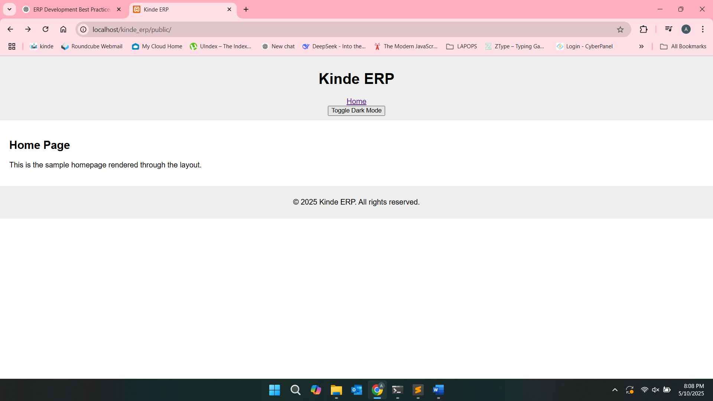

# KIND-E ERP System

Welcome to the KIND-E ERP System — a modular, clean, and expandable ERP framework built in native PHP using the MVC (Model-View-Controller) architecture.

---

## ✅ Features Implemented

### Phase 1 – Core Setup

- Clean folder structure (`controllers`, `views`, `models`)
- Basic routing system for dynamic URL dispatching
- `.env` file support for configuration
- Sample home page with routing, controller, and view
- Modular configuration system (`config.php`)
- Manual PSR-like class autoloading structure
- 404 error handling
- HomeController and basic display setup

### Phase 2 – MVC Base & Autoloading Enhancement

- Created base `Controller`, `View`, and improved `Router` classes
- Implemented layout rendering via `View::render()`
- Views now support template inheritance: layouts & partials (`main`, `header`, `footer`)
- Added support for CSS and JS asset loading
- Light/dark theme toggle placeholder using JavaScript
- Composer initialized with PSR-4 autoloading
- All classes updated to use PSR-4 namespaces

---

## 📁 Folder Structure

kinde_erp
├── app/
│ ├── controllers/ # e.g., HomeController.php
│ ├── core/ # Base MVC logic: Controller.php, Router.php, View.php
│ └── views/
│ ├── home.php
│ ├── layouts/ # e.g., main.php
│ └── partials/ # e.g., header.php, footer.php
├── config/ # config.php and environment settings
├── public/ # Public entry point and assets
│ └── assets/
│ └── css/style.css
├── logs/ # Phase logs
│ ├── phase1-log.md
│ └── phase2-log.md
├── resources/ # Frontend resources (images, etc.)
├── storage/ # Reserved for logs/cache
├── tests/ # Unit/integration tests
├── .env # Environment variables
├── .gitignore
├── composer.json # Composer config (autoloading via PSR-4)
└── index.php # Public entry point


---

## 📑 Phase Logs

- [Phase 1 Log](logs/phase1-log.md)
- [Phase 2 Log](logs/phase2-log.md)

---

## ⚙️ How to Run

1. Clone the repository:

```bash
git clone <repo-url>
cd <repo-directory>
```
2. Set up your .env file with database config, base URL, etc.

3. Ensure .htaccess exists in the public/ directory:

RewriteEngine On
RewriteRule ^ index.php [QSA,L]

4. Install Composer dependencies:

```
composer install
```

5. Navigate to the public folder:
```
cd public/
```

6. Run on browser:

http://localhost/<repo-directory>


### 🔐 Authentication (Upcoming in Phase 3)
- User login and logout
- Session management
- Protected routes (middleware)
- Basic user table and model


### ✅ Updated `logs/phase2-log.md`


---------------------------------------------------
# 🚀 Phase 2 Log - MVC Base System
----------------------------------------------------

## 📆 Started: 2025-05-10  
## 🔁 Status: In Progress  
## 🔍 Phase Lead: Allan Kipruto  

---

### ✅ Objectives

- Implement base MVC structure
- Create `View::render()` with layout support
- Setup layout and partials (`header`, `footer`)
- Improve 404 error handling
- Enable CSS/JS asset support
- Add light/dark mode toggle placeholder
- Integrate Composer with PSR-4 autoloading

---


### 📂 File & Folder Updates

app/
├── controllers/
│   └── HomeController.php ← Uses PSR-4 namespace
├── core/
│   ├── Controller.php ← Shared controller logic
│   ├── Router.php ← Enhanced routing with 404 fallback
│   └── View.php ← Layout + template rendering logic
views/
├── home.php ← Rendered via main layout
├── layouts/
│   └── main.php ← Master layout file
├── partials/
│   ├── header.php ← Header (with dark/light toggle)
│   └── footer.php ← Footer section
public/
├── assets/
│   └── css/
│       └── style.css ← Contains minimal light/dark styles
logs/
├── phase1-log.md
└── phase2-log.md

---

### 🗂 Task Log (Chronological)

| Date       | Task                                               | Status     |
|------------|----------------------------------------------------|------------|
| 2025-05-10 | Created `phase-2-mvc-base` branch                  | ✅ Done     |
| 2025-05-10 | Updated README with Phase 2 objectives             | ✅ Done     |
| 2025-05-10 | Created `logs/phase2-log.md`                       | ✅ Done     |
| 2025-05-10 | Started building `View` base class                 | ✅ Done     |
| 2025-05-10 | Implemented `Controller.php`                       | ✅ Done     |
| 2025-05-10 | Updated `Router.php` with fallback to 404 view     | ✅ Done     |
| 2025-05-10 | Built layout structure: `layouts/`, `partials/`    | ✅ Done     |
| 2025-05-10 | Added light/dark mode placeholder in header        | ✅ Done     |
| 2025-05-10 | Initialized Composer and PSR-4 config              | ✅ Done     |
| 2025-05-10 | Ran `composer dump-autoload`                       | ✅ Done     |
| 2025-05-10 | Refactored classes to use namespaces               | ✅ Done     |

---

## 🛠 How to Run

1. Start XAMPP or your local Apache server.
2. Navigate to `http://localhost/kinde_erp/public/`.
3. The home page should render through the main layout.
4. Use the toggle button in the header to test dark/light placeholder.

---

## 📦 Composer Integration (PSR-4)

- Composer initialized via `composer init`
- Autoloading setup:

```json
"autoload": {
    "psr-4": {
        "Kinde\\KindeErp\\": "app/"
    }
}
```

- Required command run:
```
composer dump-autoload
```
## 📌 Next Phase

Prepare for user login system (Phase 3):

AuthController

Login form and validation

Session-based middleware

User table and model

## ✅ Routing & Controller Setup Finalization

- Routing is now handled by `App\Core\Router` loaded in `public/index.php`
- All controllers follow PSR-4 autoloading and are namespaced under `Kinde\KindeErp\Controllers`
- Views are rendered via `App\Core\Controller::view()` and pass a `$base_url` to layout
- Assets (CSS/JS) are correctly loaded from `/public/assets/` via `config.php` base URL


✅ Phase 3: Authentication System (Completed)
Implemented AuthController with login and logout methods.

Users can authenticate using username or email + password (SHA256 hashed).

Sessions are initialized via SessionHelper, with user data stored for access control.

Built login form with client-side and server-side validation.

Session-based middleware guards protect authenticated routes and redirect unauthorized users.

On successful login, users are redirected based on role/designation.

Added logout button in header, styled and aligned with user info and theme toggle.

Secured routing for module access to prevent bypassing via direct URL.

All logic follows MVC pattern, cleanly separated into controllers, models, and views.

✅ Phase 3 sets the foundation for role-based access control (RBAC), dynamic dashboards, and secure module loading in upcoming phases.


Here’s a **README summary for Phase 4**, directly based on the checklist and tweaked to reflect completion and implementation details:

---

## 📦 Phase 4 – Activity Tracker MVP (Completed)

This phase delivered a structured task tracking system, focused on improving accountability, clarity, and auditability of weekly staff activities across projects.

### ✅ Implementation Summary Based on Checklist

| #      | Feature / Requirement                                                     | Status | Summary                                                                     |
| ------ | ------------------------------------------------------------------------- | ------ | --------------------------------------------------------------------------- |
| **1**  | Dynamic task entry form (multiple rows per entry)                         | ✅      | Fully implemented. Allows grouped task entry via multiple dynamic rows.     |
| **2**  | Fields per task: title, assignee, deliverable, resource                   | ✅      | Captured per task in the dynamic form and stored independently.             |
| **3**  | Auto-generated week via JS                                                | ✅      | Week number derived from selected date in the form.                         |
| **4**  | Activity date must be today or one day prior                              | ✅      | Enforced through front-end date limits and backend validation.              |
| **5**  | Each row saved as independent DB activity                                 | ✅      | Each task entry creates its own row in the `activity_tasks` table.          |
| **6**  | Finalized `activities` and `activity_tasks` table structures              | ✅      | Includes `status`, `is_edited`, `updated`, and relational foreign keys.     |
| **7**  | `status` field with defined workflow                                      | ✅      | Uses enums: `Not started`, `In progress`, `Done`, `Postponed`, `Cancelled`. |
| **8**  | Track status change with timestamps and updater info                      | ✅      | Captured in new `activity_task_updates` table.                              |
| **9**  | Comments mandatory for status changes (except `Done`)                     | ✅      | Frontend and backend enforcement in place.                                  |
| **10** | Prevent edits when status is not "Not started" or date is past            | ✅      | UI disables editing; backend rejects invalid edits.                         |
| **11** | Preserve original task on edit                                            | ✅      | Old version logged in `activity_task_edits`.                                |
| **12** | `activity_task_edits` table for audit log                                 | ✅      | Stores complete snapshot of previous version.                               |
| **13** | `is_edited` + `edited_at` tracking per task                               | ✅      | Marked visually and stored for traceability.                                |
| **14** | Edited activities clearly marked in UI                                    | ✅      | Shown via icons, highlights, or status indicators.                          |
| **15** | View history per task                                                     | ✅      | Modal or toggle UI for past comments and updates.                           |
| **16** | Admin/HR dashboard with filtering                                         | ✅      | Filters by user, department, week; powered by controller backend.           |
| **17** | No delete feature implemented                                             | ✅      | Task deletions are disabled to ensure traceability.                         |
| **18** | Logic separation between `activities`, `activity_tasks`, and `task_edits` | ✅      | Respected through well-structured MVC routes and queries.                   |
| **19** | Final README for Phase 4                                                  | ✅      | Documented here.                                                            |
| **20** | Phase signed off                                                          | ✅      | Internally reviewed and accepted.                                           |

---

### 🧩 Database Schema Highlights

* **`activities`** – Groups tasks per weekly submission (date, user, week).
* **`activity_tasks`** – Contains actual task data and status.
* **`activity_task_updates`** – Tracks each status update and comment per task.
* **`activity_task_edits`** – Stores full copies of task data before edits.
* **`activity_weekly_remarks`** – Allows HR/Admins to leave remarks per user per week.

---

### 🎯 Business Value

* Promotes transparency and structure in weekly project reporting.
* Provides detailed audit trails for edits, updates, and status transitions.
* Supports HR/management in evaluating task distribution, progress, and blockers.

---

Let me know if you want this saved to a file like `README_phase_4.md` or embedded in your main project README.


## 📦 Phase 4.5 - UI Enhancements & Theme Preferences

This phase focuses on finalizing the MVP's user interface and user experience:

### ✅ Features Implemented

- Responsive and collapsible sidebar with active tab highlighting
- Icon integration via Lucide for sidebar and header links
- Header redesigned with:
  - Logo + title alignment
  - Navigation items with icons
  - Mobile-responsive layout
- Dark Mode toggle:
  - Icon switch between sun and moon
  - Seamless toggle without page reload
  - Theme preference saved to session via AJAX
- Custom dark mode styles with shadow separation for:
  - Header, sidebar, footer, and body
- Visual consistency across light and dark modes
- Added `ui-preference/theme` endpoint for theme persistence

### ⚙️ Files/Components Affected

- `public/assets/css/` → Sidebar, header, and dark mode styles
- `resources/views/layouts/` → Header and sidebar markup updates
- `public/assets/js/theme-toggle.js` → New script for theme handling
- `ui-preference/theme` (controller/route) → New route to handle theme session preference

---

> 🎉 Final touches for Phase 4 complete. The UI is now sleek, responsive, and user-personalized!
